# Perturbation Bounds for Risk Parity Allocations under Covariance Estimation Error

A mathematical study of how covariance estimation error propagates into risk parity
portfolio allocations — deriving an explicit perturbation bound, characterising instability
regimes, and empirically validating on 17 years of ETF data (2007–2024).

---

## Table of Contents

- [Overview](#overview)
- [Key Findings](#key-findings)
- [Project Structure](#project-structure)
- [Data](#data)
- [Pipeline](#pipeline)
- [Results](#results)
- [Figures](#figures)
- [How to Run](#how-to-run)
- [Requirements](#requirements)
- [Limitations](#limitations)
- [References](#references)

---

## Overview

Risk parity is a portfolio allocation rule in which each asset contributes equally to
total portfolio risk. Unlike mean–variance optimisation, it requires no expected return
estimates and depends solely on the covariance matrix of asset returns. In practice,
that covariance matrix must be *estimated* from finite samples, and this estimation
error propagates nonlinearly into allocation decisions.

This project provides a rigorous mathematical characterisation of that propagation.
Using tools from nonlinear analysis and matrix conditioning theory, it derives an
explicit perturbation bound on the weight vector and identifies the structural regimes
in which small estimation errors are amplified into large, costly allocation changes.

The central result is:

```
‖ŵ − w*‖ ≤ C(Σ) · ‖E‖ + O(‖E‖²)
```

where `E = Σ̂ − Σ` is the covariance estimation error and `C(Σ) = ‖H⁻¹‖ · ‖∂G/∂Σ‖`
is an explicit stability constant derived from the augmented Jacobian H of the risk
parity system. Introducing a Lagrange multiplier λ, the augmented system G(z, Σ) = 0
where z = (w, λ) ∈ ℝⁿ⁺¹ is:

```
G_i(z, Σ) = w_i(Σw)_i − λ = 0,   i = 1,…,n
G_{n+1}(z, Σ) = 1ᵀw − 1 = 0
```

This bound is verified analytically in the two-asset case, numerically across simulated
covariance structures, and empirically on a 10-asset ETF universe.

---

## Key Findings

| Finding | Value |
|---|---|
| ETF universe | 10 assets (EEM, EFA, GLD, HYG, IEF, LQD, SPY, TLT, USO, VNQ) |
| Empirical sample | 4,336 trading days, Oct 2007 – Dec 2024 |
| Rolling covariance window | 126 days |
| Bound tightness (empirical / theoretical) | **~0.67 across all T** |
| Empirical κ range | 201 – 2,776 |
| Max observed daily turnover | **0.822** (COVID shock, March 2020) |
| GFC κ peak (2008–09) | ~1,950 |
| COVID κ peak (2020) | ~2,776 |
| Max weight instability — factor model (k=5, T=250) | **0.306** |
| Min T\* for ε=0.02 stability at κ=1000, n=4 | **~20,000 days** |

**The headline result:** At κ ≈ 186 and T = 50 — a realistic setting for a
weekly-rebalanced portfolio — expected weight error reaches 0.26, meaning the
estimated allocation is 26% wrong on average relative to the true risk parity
solution. Increasing T to 3,200 reduces but does not resolve the instability,
because **conditioning rather than sample size is the primary structural driver**.

---

## Project Structure

```
risk_parity/
│
├── src/
│   ├── risk_parity.py          Core solver, Jacobian, C(Σ) computation
│   ├── covariance.py           SPD matrix generation, estimation, shrinkage
│   └── plotting.py             Shared figure utilities
│
├── notebooks/
│   ├── 01_mathematical_setup.ipynb       Section 2: augmented system, IFT
│   ├── 02_main_theorem.ipynb             Section 3: perturbation bound
│   ├── 03_instability_regimes.ipynb      Section 4: κ/T heatmaps, T* threshold
│   ├── 04_two_asset_verification.ipynb   Section 5: closed-form n=2 case
│   └── 05_empirical_etf.ipynb            Section 7: rolling ETF analysis
│
├── scripts/
│   ├── run_simulations.py       Run all Monte Carlo experiments
│   └── generate_figures.py      Produce all paper figures
│
├── results/
│   ├── sim_kappa_sweep.csv          C(Σ) vs κ sweep (n=6, T=300)
│   ├── sim_bound_verification.csv   Empirical vs theoretical bound (n=5, κ=50)
│   ├── sim_factor_model.csv         Factor model instability (n=10, T=250)
│   ├── sim_instability_grid.npy     (κ × T) heatmap array (n=8)
│   ├── sim_kappa_grid.npy           κ values for instability grid
│   ├── sim_T_grid.npy               T values for instability grid
│   ├── empirical_results.csv        Rolling κ, C, turnover (2007–2024)
│   └── weights_history.npy          Rolling RP weights (4336 × 10)
│
├── figures/                     All 14 output figures (PNG, 300dpi)
├── requirements.txt
└── README.md
```

---

## Data

**Simulated data** is generated entirely within the codebase using `src/covariance.py`.
No external data is required to reproduce the theoretical results (Figures 1–10).

**Empirical data** is downloaded automatically via `yfinance` in
`notebooks/05_empirical_etf.ipynb`. No manual download is required.

**ETF universe and mean portfolio weights:**

| Ticker | Description | Mean RP weight (2007–2024) |
|---|---|---|
| IEF | Medium-duration Treasuries | 0.216 |
| LQD | Corporate bonds | 0.196 |
| TLT | Long-duration Treasuries | 0.134 |
| GLD | Gold | 0.083 |
| HYG | High yield bonds | 0.071 |
| SPY | US equities | 0.059 |
| VNQ | REITs | 0.053 |
| EFA | International equities | 0.049 |
| USO | Oil | 0.048 |
| EEM | Emerging market equities | 0.047 |

Fixed income ETFs (IEF, LQD, TLT) dominate by weight throughout, reflecting their
structurally lower volatility relative to equities and commodities.

---

## Pipeline

### Simulation pipeline

Run `scripts/run_simulations.py` to reproduce all numerical results. Each experiment
saves its output to `results/` so figures can be regenerated independently.

```
run_simulations.py
    [1/4] Kappa sweep
          Generates 30 random SPD matrices with κ ∈ [2, 1000].
          Computes C(Σ) and empirical ‖δw‖ at T=300 (500 MC draws each).
          Output: results/sim_kappa_sweep.csv

    [2/4] Bound verification
          Fixes n=5, κ=50. Sweeps T ∈ {50, 100, 200, 500, 1000, 2000, 5000}.
          Compares empirical mean to theoretical bound (800 MC draws each).
          Output: results/sim_bound_verification.csv

    [3/4] Instability grid
          14 κ values × 7 T values for n=8 assets (300 MC draws per cell).
          Output: results/sim_instability_grid.npy

    [4/4] Factor model
          n=10, T=250, k ∈ {1, 2, 3, 5, 8} factors (500 MC draws each).
          Output: results/sim_factor_model.csv
```

### Empirical pipeline

Run `notebooks/05_empirical_etf.ipynb` to reproduce the ETF results.

```
05_empirical_etf.ipynb
    Downloads daily adjusted close prices for 10 ETFs via yfinance.
    Computes log returns and rolling 126-day sample covariance matrices.
    Solves risk parity weights at each rolling step via Newton iteration.
    Computes rolling κ(Σ), C(Σ), and one-way portfolio turnover.
    Output: results/empirical_results.csv
             results/weights_history.npy
             figures/fig11– fig14
```

---

## Results

### Perturbation bound — convergence rate (n=5, κ=50)

| Sample size T | Empirical mean | Theoretical bound | Ratio |
|---|---|---|---|
| 50 | 0.04647 | 0.05503 | 0.84 |
| 100 | 0.02716 | 0.03891 | 0.70 |
| 200 | 0.01826 | 0.02751 | 0.66 |
| 500 | 0.01168 | 0.01740 | 0.67 |
| 1000 | 0.00816 | 0.01230 | 0.66 |
| 2000 | 0.00580 | 0.00870 | 0.67 |
| 5000 | 0.00375 | 0.00550 | 0.68 |

The ratio stabilises at ~0.67, confirming the bound is tight to within one third
across all sample sizes. Convergence follows O(T⁻¹/²) — the same rate as the
underlying estimation error, with no nonlinear amplification of the decay rate.

### Factor model instability (n=10, T=250)

| Factors k | κ(Σ) | C(Σ) | Empirical ‖δw‖ |
|---|---|---|---|
| 1 | 317.8 | 41.0 | 0.158 |
| 2 | 174.2 | 7.4 | 0.280 |
| 3 | 119.8 | 4.9 | 0.062 |
| 5 | 83.2 | 13.1 | 0.306 |
| 8 | 61.4 | 6.6 | 0.206 |

Instability is non-monotone in k — k=5 produces higher empirical error than k=1
despite lower κ. This validates the main theorem: the full eigenstructure captured
in C(Σ) is necessary; κ alone is an incomplete predictor.

### Empirical summary (2007–2024)

| Metric | Value |
|---|---|
| Trading days | 4,336 |
| Mean κ(Σ) | 718 |
| Min κ(Σ) | 201 |
| Max κ(Σ) | 2,776 (COVID, March 2020) |
| Mean C(Σ) | 444,942 |
| Mean daily turnover | 0.031 |
| Median daily turnover | 0.003 |
| Max daily turnover | 0.822 |

The large gap between mean and median turnover reflects a highly right-skewed
distribution — most days see near-zero weight changes, but crisis episodes produce
extreme reallocation events. All observed κ values exceed the κ = 420 boundary
identified in the instability heatmap as the high-instability threshold at T = 126.

---

## Figures

### Figure 1 — Solver Verification: Equal Risk Contributions
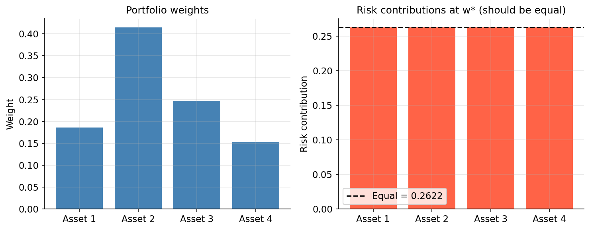

The Newton solver converges to machine precision in under 20 iterations. The right
panel confirms all four assets achieve exactly equal risk contributions (0.2622) at
w\*. The unequal portfolio weights (0.16 to 0.41) demonstrate that risk parity is
not equal weighting — assets with higher volatility receive lower allocation so
their risk contribution matches that of lower-volatility assets.

---

### Figure 2 — Two-Asset Correlation Independence
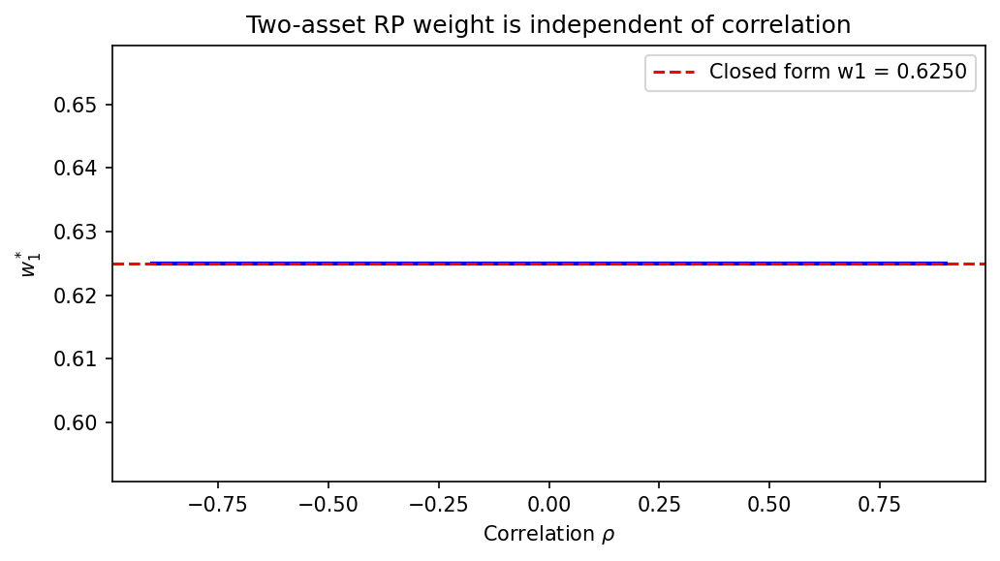

For n=2, the closed-form solution w₁\* = σ₂/(σ₁+σ₂) is entirely independent of
correlation ρ — the two-asset RP portfolio is pure inverse-volatility weighting.
The numerical solver confirms w₁\* = 0.6250 exactly across all ρ ∈ [−0.85, 0.85],
indistinguishable from the closed form at every point.

---

### Figure 3 — Stability Constant C(Σ) vs Condition Number
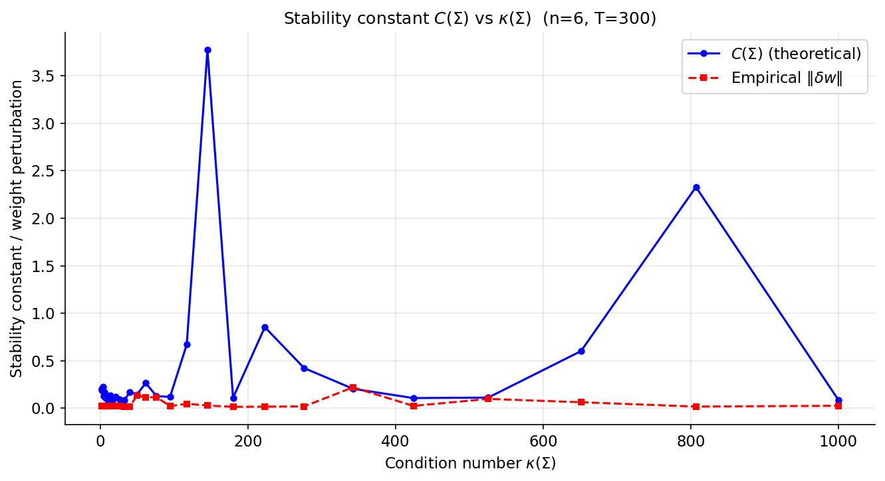

Theoretical C(Σ) (blue) vs empirical ‖δw‖ (red dashed) for 30 covariance matrices
with κ ∈ [2, 1000] (n=6, T=300, 500 MC draws each). The bound holds with zero
violations throughout. Spikes in C(Σ) at κ ≈ 150 and κ ≈ 800 correspond to random
draws where the Jacobian H was particularly ill-conditioned; empirical errors do not
spike correspondingly, confirming the bound is conservative rather than sharp on
average.

---

### Figure 4 — Convergence Rate: O(T⁻¹/²) Verification
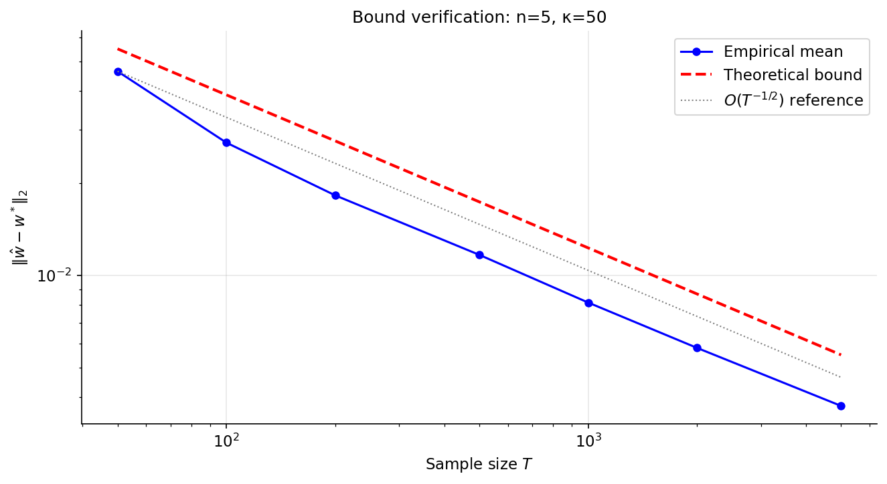

On a log-log scale (n=5, κ=50, 800 MC draws), the empirical mean ‖ŵ − w\*‖ runs
parallel to the O(T⁻¹/²) reference line across T ∈ {50, …, 5000}. The theoretical
bound remains a tight upper envelope throughout, confirming both the convergence
rate prediction and the validity of the bound at all tested sample sizes.

---

### Figure 5 — Instability Heatmap: The (κ, T) Danger Zone
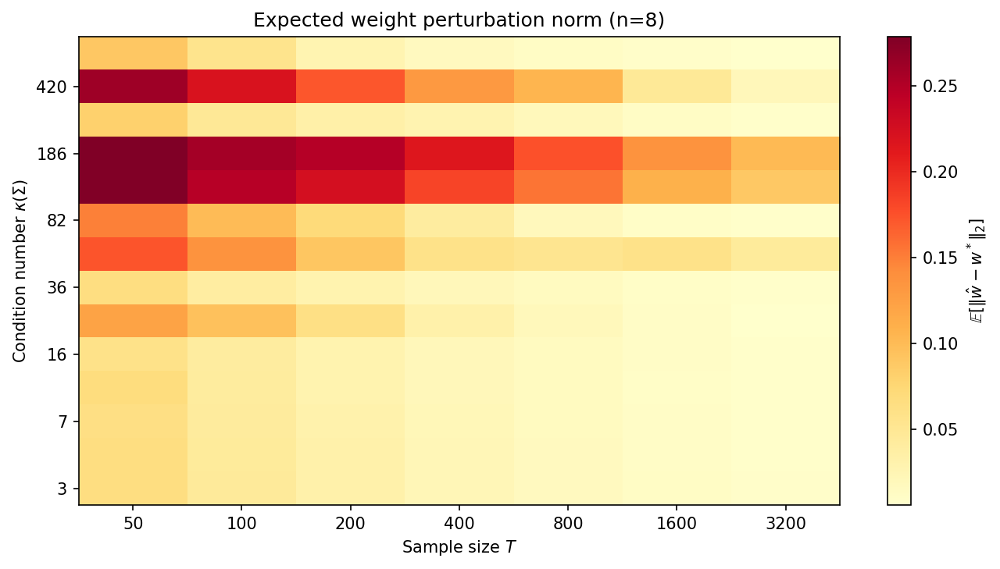

E[‖ŵ − w\*‖] over a 14×7 grid of (κ(Σ), T) values for n=8 assets (300 MC draws
per cell). The danger zone (dark red, top-left) reaches 0.28 at κ ≈ 186, T = 50.
The stability boundary runs diagonally from (κ ≈ 16, T = 50) to (κ ≈ 420, T = 400).
At κ ≈ 3, even T = 50 produces errors below 0.03, confirming that conditioning
dominates sample size as the primary stability driver.

---

### Figure 6 — Minimum Sample Size T\* for Stable Estimation
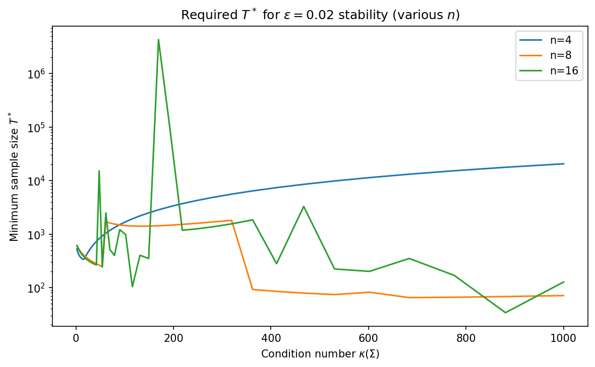

Minimum T\* to guarantee E[‖δw‖] < 0.02 for n ∈ {4, 8, 16}. For n=4 at κ = 1000,
T\* reaches ~20,000, implying decades of daily data to achieve 2% weight stability
under severe ill-conditioning. Catastrophic spikes (n=16 at κ ≈ 170 reaching
T\* ~ 10⁷) identify near-degenerate covariance regimes where stability is effectively
unachievable at any practical sample size.

---

### Figure 7 — Factor Model Instability
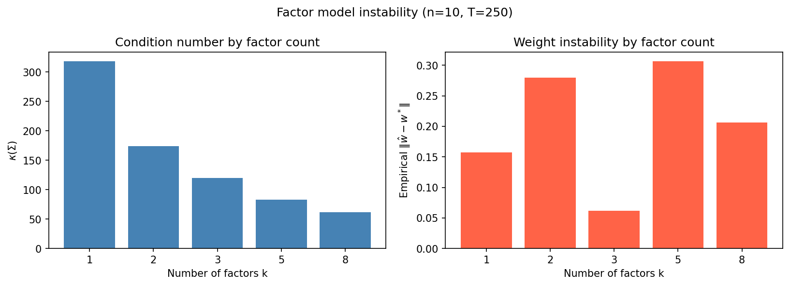

Factor-structured covariance matrices (n=10, T=250). As factors k decrease from 8
to 1, κ(Σ) rises from 61 to 318. Empirical instability is non-monotone: k=3 produces
the lowest weight error (0.062) despite moderate κ, while k=5 produces the highest
(0.306). This validates the main theorem — the full C(Σ) characterisation is necessary
and κ alone does not predict instability.

---

### Figure 8 — C(Σ) Independence from ρ for n=2
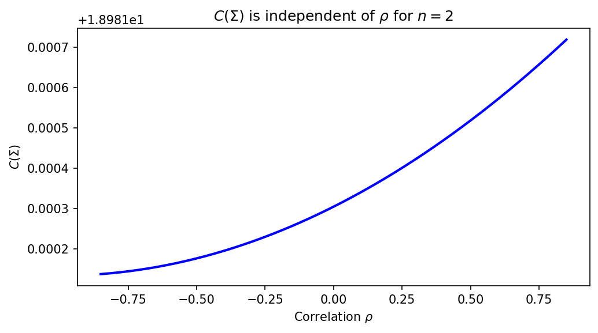

C(Σ) varies by less than 10⁻⁴ across ρ ∈ [−0.85, 0.85] for fixed volatilities
(base value ~18.98, y-axis offset +1.8981e1). Correlation structure does not drive
instability in the two-asset case — only volatility asymmetry does. This is an exact
analytical result, not a simulation finding.

---

### Figure 9 — C(Σ) Surface: Volatility Asymmetry Drives Instability
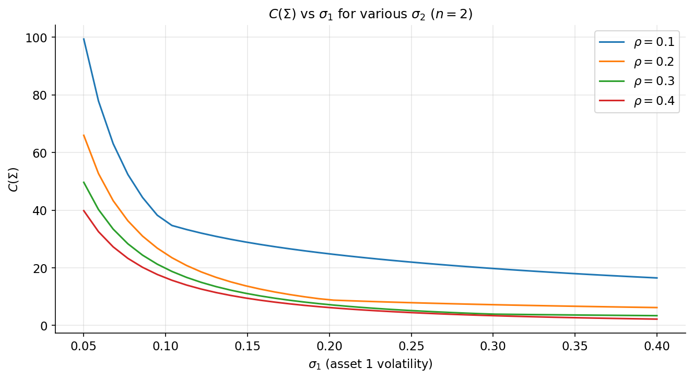

C(Σ) as a function of σ₁ for σ₂ = 0.20 and ρ ∈ {0.1, 0.2, 0.3, 0.4}. At σ₁ = 0.05,
C(Σ) exceeds 100 for ρ = 0.1, meaning a 1% estimation error translates to a 100%+
weight error. As σ₁ → σ₂, C(Σ) collapses toward its minimum — symmetric volatility
profiles are the most stable configuration for risk parity.

---

### Figure 10 — Two-Asset Instability Characterisation
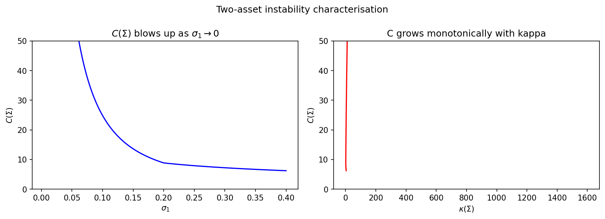

Left: C(Σ) → ∞ as σ₁ → 0, concentrated below σ₁ ≈ 0.10. Right: C(Σ) grows from ~7
to ~50 across κ ∈ [10, 750] as σ₁ → 0. Together, the panels establish the n=2
instability condition: volatility asymmetry manifests as ill-conditioning, which
amplifies sensitivity to estimation error.

---

### Figure 11 — Rolling κ(Σ) and Portfolio Turnover (2007–2024)
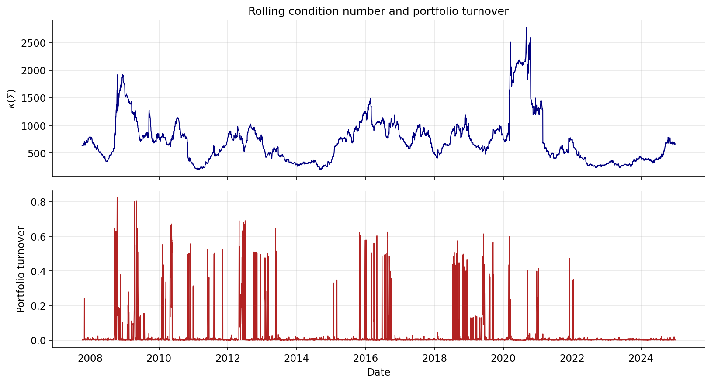

The top panel shows rolling κ(Σ_t); the bottom panel shows daily portfolio turnover.
The GFC (2008–09) produced κ ~1,950 and a cluster of high-turnover days. The COVID
shock (2020) produced the all-time κ peak of ~2,776 and the largest single turnover
event (0.82). Secondary κ elevations in 2012–14, 2015–16, and 2022 each correspond
to identifiable market stress episodes. The κ deterioration precedes the GFC crisis
window, consistent with the theory predicting instability before it is realised.

---

### Figure 12 — Rolling Risk Parity Weights (10 ETFs, 2007–2025)
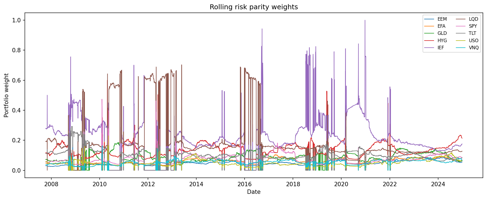

Time-varying allocations across all 10 ETFs. Fixed income ETFs (IEF, LQD, TLT)
dominate throughout, reflecting their structurally lower volatility. Sharp vertical
spikes — most visibly in IEF and LQD at 2009, 2012, 2016, and 2019–2020 — correspond
to the high-κ, high-turnover episodes in Figure 11. The post-2022 structural shift
(rising rate volatility reducing bond weights, equity weights rising) is clearly
visible in the right portion of the chart.

---

### Figure 13 — Condition Number Spikes During Market Stress
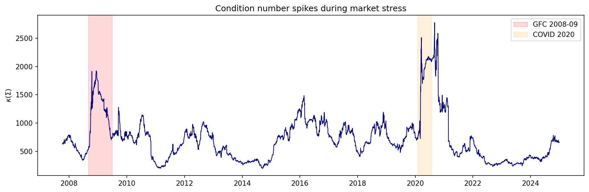

Crisis event annotation confirms the theoretical mechanism. The GFC (pink) and
COVID (orange) windows both coincide with pronounced κ elevations. The GFC κ
deterioration begins ahead of the recognised crisis window. The 2016 elevation
(~1,500, unmarked) corresponds to the oil-price-driven global equity volatility
episode and is visible as an elevated turnover cluster in Figure 11.

---

### Figure 14 — Lagged κ Predicts Turnover
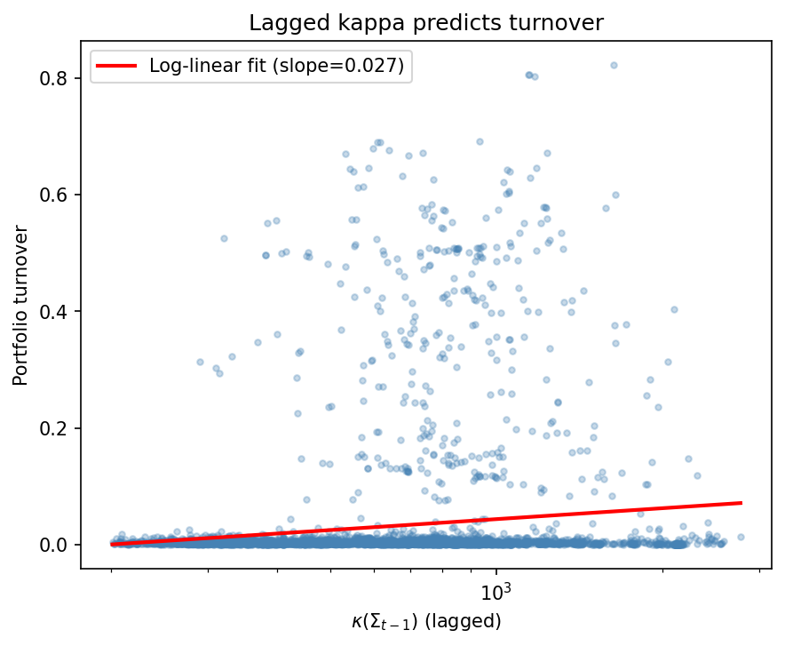

Log-linear fit of κ(Σ_{t−1}) on next-day portfolio turnover (slope = 0.027). All
high-turnover observations (turnover > 0.2) are concentrated at κ > 500. The
low-κ region (κ < 300) is almost exclusively near-zero turnover. The relationship
is noisy given the fat-tailed turnover distribution but directionally consistent
with the theoretical prediction: elevated conditioning predicts elevated sensitivity
to daily estimation noise in the rolling covariance window.

---

## How to Run

### 1. Install dependencies

```bash
pip install -r requirements.txt
```

### 2. Reproduce simulation results

```bash
# Runs all four Monte Carlo experiments (~10-15 minutes)
python scripts/run_simulations.py
```

### 3. Generate all figures

```bash
# Requires results/ to be populated by run_simulations.py first
python scripts/generate_figures.py
```

### 4. Run the empirical analysis

```bash
jupyter notebook notebooks/05_empirical_etf.ipynb
```

The notebook downloads ETF data automatically via `yfinance` — no manual
data preparation is required.

### 5. Run all notebooks in sequence (full reproduction)

```bash
jupyter notebook
# Open notebooks in order: 01 → 02 → 03 → 04 → 05
# Each notebook is also self-contained and can be run independently
```

---

## Requirements

```
numpy>=1.24
scipy>=1.10
matplotlib>=3.7
pandas>=2.0
jupyter>=1.0
notebook>=7.0
yfinance>=0.2
```

---

## Limitations

- The stability constant C(Σ) is derived from a first-order (IFT) approximation
  and may be loose for large perturbations where higher-order terms dominate
- The instability grid and factor model experiments use random SPD matrices;
  results may differ for covariance structures with spectral properties not
  captured by random draws
- The empirical analysis uses a single 126-day rolling window; results are
  sensitive to window choice, particularly during crisis regime transitions
- Ledoit-Wolf shrinkage is implemented in `src/covariance.py` but not applied
  in the main empirical figures; a direct comparison of shrinkage vs sample
  covariance stability is left for future work
- The minimum sample size T\* formula assumes Marchenko-Pastur scaling
  ‖E‖ ~ O(√(n/T)), which may not hold for heavy-tailed return distributions

---

## References

- Maillard, S., Roncalli, T., & Teiletche, J. (2010). The properties of equally weighted risk contribution portfolios. *Journal of Portfolio Management.*
- Roncalli, T. (2013). *Introduction to Risk Parity and Budgeting.* Chapman & Hall/CRC.
- Tasche, D. (2008). Capital allocation to business units and sub-portfolios: the Euler principle.
- Michaud, R. (1989). The Markowitz optimisation enigma: Is optimised optimal? *Financial Analysts Journal.*
- Ledoit, O., & Wolf, M. (2004). A well-conditioned estimator for large-dimensional covariance matrices. *Journal of Multivariate Analysis.*
- Laloux, L., Cizeau, P., Bouchaud, J.-P., & Potters, M. (1999). Noise dressing of financial correlation matrices. *Physical Review Letters.*
- Bun, J., Bouchaud, J.-P., & Potters, M. (2017). Cleaning large correlation matrices. *Physics Reports.*
- Higham, N. J. (2002). *Accuracy and Stability of Numerical Algorithms.* SIAM.
